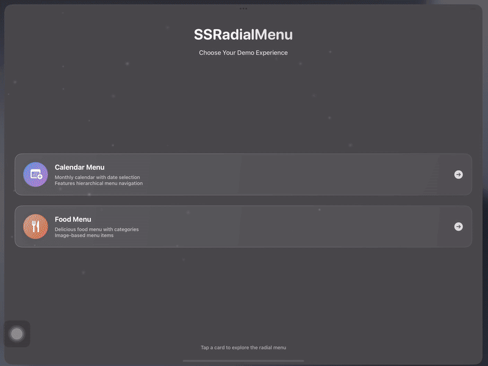
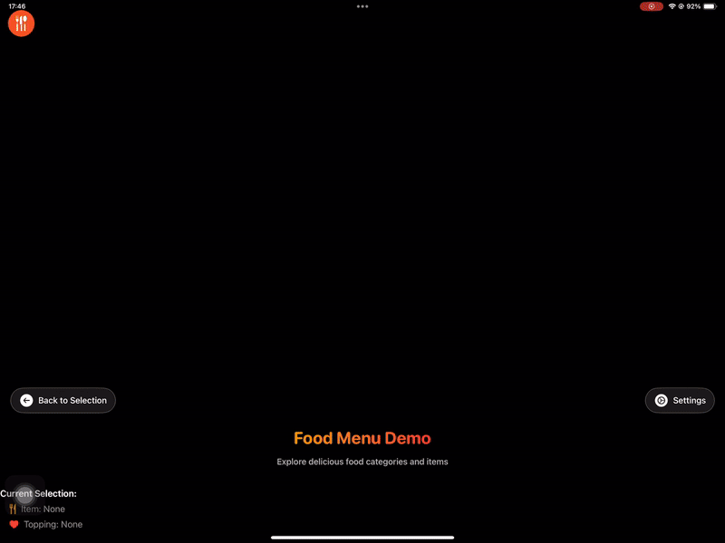

# SSRadialMenu

A highly customizable, performance-optimized SwiftUI radial menu component with support for hierarchical navigation, smooth animations, and advanced interaction patterns.

## Requirements

- iOS 17.0+ 
- macOS 13.0+

## Features

### 🎯 Core Functionality
- **Hierarchical Menu Structure**: Support for 3-level menu hierarchy (main → sub -> sub-sub)
- **Flexible Positioning**: Four alignment options (top-left, top-right, bottom-left, bottom-right)
- **Multiple Display Options**: Support for SF Symbols, custom images, and badge text
- **Selection Tracking**: Built-in callbacks for tracking selections at each menu level

### 🎨 Visual Customization
- **Adaptive Card Sizing**: Customizable main card size with automatic sub-menu scaling
- **Zoom Effects**: Optional zoom effect for selected items with configurable scale and opacity
- **Custom Icons**: Support for both expand/collapse icons and images
- **Badge System**: Hierarchical badge text with automatic sizing based on menu level
- **Smooth Animations**: Sequential entrance animations and smooth transitions

### 📱 Interaction Patterns
- **Drag Scrolling**: Smooth drag-to-scroll with momentum physics
- **Spin Wheel Mode**: Advanced spinning behavior with velocity-based momentum
- **Wrap Support**: Optional infinite scrolling or bounded navigation
- **Touch Gestures**: Tap to select, drag to scroll, with gesture conflict resolution

## Basic Usage

```swift
import SwiftUI

struct ContentView: View {
    let menuItems = [
        RadialMenuItems(name: "Home", icon: "house.fill"),
        RadialMenuItems(name: "Settings", icon: "gear"),
        RadialMenuItems(name: "Profile", icon: "person.circle")
    ]
    
    var body: some View {
        SSRadialMenu(
            menuItems: menuItems,
            alignment: .bottomTrailing,
            expandMenuIcon: "plus.circle.fill",
            collapseMenuIcon: "xmark.circle.fill"
        )
    }
}
```

## Example

### 1. Calendar menu demo - 


### 2. Food menu demo - 


## Installation

### Swift Package Manager

Add the following to your `Package.swift` file:

```swift
dependencies: [
    .package(url: "https://github.com/youruserSimformSolutionsPvtLtdname/SSRadialMenu.git", from: "1.0.0")
]
```

Or add it through Xcode:
1. File → Add Package Dependencies
2. Enter the repository URL
3. Select version and add to target


## Configuration Parameters

### Basic Configuration

| Parameter | Type | Default | Description |
|-----------|------|---------|-------------|
| `menuItems` | `[RadialMenuItems]` | Required | Array of menu items to display |
| `alignment` | `AlignmentType` | `.bottomTrailing` | Menu button position |
| `expandMenuIcon` | `String?` | `nil` | SF Symbol for expand state |
| `collapseMenuIcon` | `String?` | `nil` | SF Symbol for collapse state |
| `expandMenuImage` | `String?` | `nil` | Custom image for expand state |
| `collapseMenuImage` | `String?` | `nil` | Custom image for collapse state |
| `mainCardSize` | `CGFloat` | `55.0` | Size of main menu cards |

### Visual Effects

| Parameter | Type | Default | Description |
|-----------|------|---------|-------------|
| `zoomEffectEnabled` | `Bool` | `true` | Enable zoom effect on selection |
| `zoomEffectScale` | `CGFloat?` | `nil` | Zoom scale factor (auto-calculated if nil) |
| `zoomOpacityReduction` | `Double` | `0.3` | Opacity reduction for non-zoomed items |
| `spinsItemsDuringDrag` | `Bool` | `true` | Rotate items during drag gesture |

### Scrolling Behavior

| Parameter | Type | Default | Description |
|-----------|------|---------|-------------|
| `scrollingBehavior` | `ScrollingBehavior` | `.simple` | Scrolling mode (`.simple` or `.spinWheel`) |
| `spinWheelSpeed` | `SpinWheelSpeed` | `.normal` | Speed for spin wheel mode (`.slow`, `.normal`, `.fast`) |
| `wrapEnabled` | `Bool` | `true` | Enable infinite scrolling |
| `scrollThresholdItemCount` | `Int` | `6` | Minimum items required to enable scrolling |

### Selection Callbacks

| Parameter | Type | Default | Description |
|-----------|------|---------|-------------|
| `onMainMenuSelection` | `((RadialMenuItems) -> Void)?` | `nil` | Called when main menu item is selected |
| `onSubMenuSelection` | `((RadialMenuItems) -> Void)?` | `nil` | Called when sub-menu item is selected |
| `onSubSubMenuSelection` | `((RadialMenuItems) -> Void)?` | `nil` | Called when sub-sub-menu item is selected |

---

## License

This project is licensed under the MIT License - see the [LICENSE](LICENSE.txt) file for details.

## 🤝 How to Contribute

Whether you're helping us fix bugs, improve the docs, or a feature request, we'd love to have you! :muscle:

Check out our [**Contributing Guide**](CONTRIBUTING.md) for ideas on contributing.

## Find this sample useful? :heart:

Support it by joining [stargazers] :star: for this repository.

## Bugs and Feedback

For bugs, feature requests, and discussion use [GitHub Issues].

## Other Mobile Libraries

Check out our other libraries [Awesome-Mobile-Libraries].

<!-- Reference links -->

[SSRadialMenu]: https://github.com/SimformSolutionsPvtLtd/SSRadialMenu.git

[stargazers]: https://github.com/SimformSolutionsPvtLtd/SSRadialMenu/stargazers

[GitHub Issues]: https://github.com/SimformSolutionsPvtLtd/SSRadialMenu/issues

[Awesome-Mobile-Libraries]: https://github.com/SimformSolutionsPvtLtd/Awesome-Mobile-Libraries
